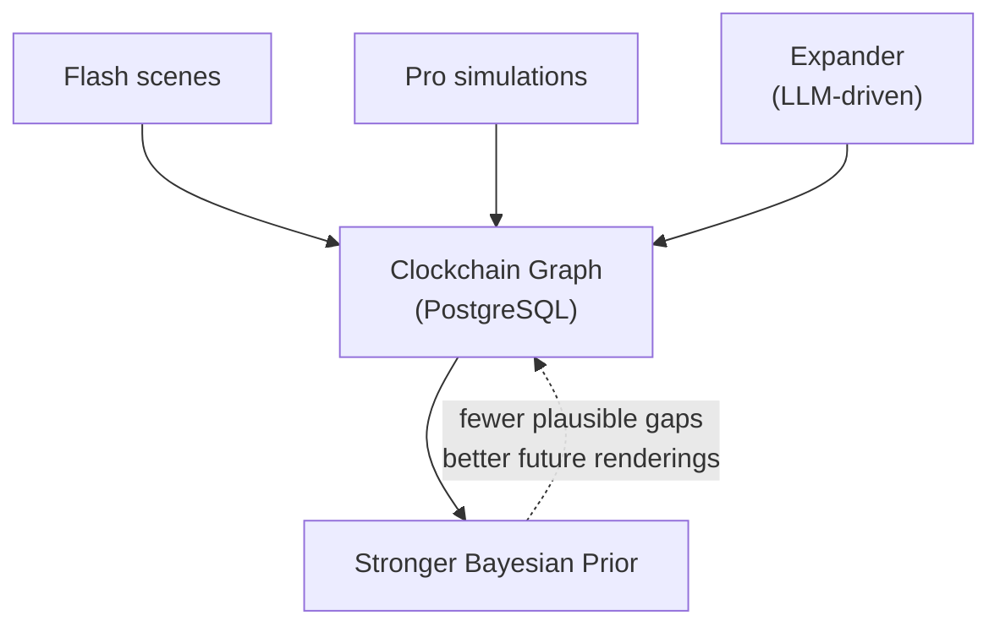

# timepoint-clockchain

**Temporal causal graph for AI agents.** PostgreSQL-backed directed graph of historical moments — canonical spatiotemporal URLs, typed causal edges, autonomous expansion, and browse/search/discovery APIs.

> [!NOTE]
> **Why this exists** — AI agents that reason about causality across time currently rely on web search (noisy, unstructured), knowledge graphs (no temporal dimension), or hallucination. The Clockchain is a structured alternative: every node carries dialog, entity states, provenance, and confidence, addressed by a canonical spatiotemporal URL, in a format ([TDF](https://github.com/timepointai/timepoint-tdf)) designed for machine consumption.

The graph accumulates two layers of rendered reality:

- **Rendered Past** — historical events rendered by [Flash](https://github.com/timepointai/timepoint-flash) with full causal structure, entity states, dialog, and source grounding
- **Rendered Future** — simulation outputs from [Pro](https://github.com/timepointai/timepoint-pro), scored for convergence, stored as TDF records

Each new event with causal edges tightens the Bayesian prior — fewer plausible things *could* have happened in the gaps — approaching asymptotic coverage of any historical period.

*The name is conceptual. This is PostgreSQL, not a blockchain.*



## Suite Context

Part of the [Timepoint AI](https://github.com/timepointai) suite — the Clockchain is the temporal causal graph that all other services read from and write to.

**Deployed at:** `clockchain.timepointai.com` (via API gateway at `api.timepointai.com/api/v1/clockchain/*`)

## Graph Architecture

The Clockchain is a directed graph stored in PostgreSQL (two tables: `nodes` and `edges`). Each node is a historical moment identified by a canonical temporal URL. Edges encode typed relationships between moments.

### Canonical URL Format

Every node has a unique spatiotemporal address — 8 segments encoding *when* and *where*:

```
/-44/march/15/1030/italy/lazio/rome/assassination-of-julius-caesar
  │    │    │   │     │     │    │    └── slug (auto-generated)
  │    │    │   │     │     │    └─────── city
  │    │    │   │     │     └──────────── region
  │    │    │   │     └───────────────── country (modern borders)
  │    │    │   └───────────────────── time (24hr, no colon)
  │    │    └───────────────────────── day
  │    └────────────────────────────── month (lowercase name)
  └─────────────────────────────────── year (negative = BCE)
```

Negative years for BCE, all segments kebab-case. This path is both the node's primary key and its API address.

### Content Layers

| Layer | Content | Storage |
|-------|---------|---------|
| 0 | URL path + event name | Clockchain graph (Postgres `nodes` table) |
| 1 | Metadata: figures, tags, one-liner description | Clockchain graph (Postgres `nodes` table) |
| 2 | Full Flash scene reference | `flash_timepoint_id` field in graph node |

### Edge Types (Schema v0.2)

| Type | Meaning | Auto-linked? |
|------|---------|-------------|
| `causes` | Direct causal relationship | No — expander or manual only |
| `caused_by` | Inverse causal relationship | No — expander or manual only |
| `influences` | Indirect influence | No — expander or manual only |
| `precedes` | Temporal ordering | No — expander or manual only |
| `follows` | Inverse temporal ordering | No — expander or manual only |
| `same_era` | Same year (+/- 1) | Yes, weight 0.5 |
| `same_location` | Matching country + region + city | Yes, weight 0.5 |
| `same_conflict` | Part of the same military/political conflict | No — expander or manual only |
| `same_figure` | Shared historical figure | No — expander or manual only |
| `thematic` | Overlapping tags (array overlap) | Yes, weight 0.3 |
| `contemporaneous` | Legacy alias for `same_era` | Supported for backwards compatibility |

When a node is added via `add_node()`, the `_auto_link()` method creates bidirectional edges for `same_era`, `same_location`, and `thematic` using efficient `INSERT...SELECT` queries.

### Database Schema

Two tables with indexes:

```sql
nodes (id TEXT PK, type, name, year, month, month_num, day, time,
       country, region, city, slug, layer, visibility, created_by,
       tags TEXT[], one_liner, figures TEXT[], flash_timepoint_id,
       flash_slug, flash_share_url, era, image_url,
       confidence FLOAT, source_run_id, tdf_hash, source_type,
       schema_version, text_model, image_model,
       model_provider, model_permissiveness, generation_id,
       graph_state_hash, created_at, published_at)

edges (source TEXT FK, target TEXT FK, type TEXT CHECK(...),
       weight FLOAT, theme TEXT, description TEXT, created_by TEXT,
       schema_version TEXT, source_run_id TEXT,
       PK(source, target, type))
```

Indexes on: visibility, (month, day), year, (country, region, city), GIN on tags/figures, GIN trigram on name/one_liner (when pg_trgm is available).

### Model Provenance (Schema v0.2)

Every node tracks which models generated its content:

| Field | Meaning |
|-------|---------|
| `text_model` | LLM used for text (e.g. `deepseek/deepseek-chat-v3-0324`) |
| `image_model` | Model used for images (e.g. `stabilityai/stable-diffusion-3`) |
| `model_provider` | Provider name (e.g. `deepseek`, `stabilityai`) |
| `model_permissiveness` | Policy tier (`permissive`, `standard`, `unknown`) |
| `generation_id` | Unique generation run ID |
| `schema_version` | Schema version (`0.1`, `0.2`) |

Clockchain enforces **permissive-only** models — blocked providers (google, anthropic, openai) are rejected at the compliance gate.

### Source Types

| Type | Meaning |
|------|---------|
| `historical` | Verified historical event (seed data or curated) |
| `expander` | Generated by autonomous graph expansion (LLM-driven) |
| `simulation` | Output from Pro temporal simulation |
| `predicted` | Rendered Future awaiting validation |

### Interoperability

Clockchain nodes are expressible as TDF records via `timepoint-tdf`. The TDF bridge (`app/core/tdf_bridge.py`) promotes model provenance fields to `TDFProvenance` (TDF v1.2.0+), with backwards-compatible fallback for older TDF versions.

**Proof of Causal Convergence (PoCC)** is a future protocol concept: multiple independent renderings that converge on the same causal structure provide validation without ground truth. The Clockchain is the natural accumulation point for convergent paths.

## Autonomous Workers

Five background workers handle content generation and graph growth:

| Worker | File | Purpose | Feature Flag |
|--------|------|---------|-------------|
| **Renderer** | `app/workers/renderer.py` | HTTP client for Flash scene generation; supports `model_policy` parameter for permissive routing | Always available |
| **Expander** | `app/workers/expander.py` | LLM-driven autonomous graph growth; picks low-degree frontier nodes and generates related events via OpenRouter | `EXPANSION_ENABLED=true` + `OPENROUTER_API_KEY` |
| **Judge** | `app/workers/judge.py` | LLM content moderation gate; classifies queries as approve/sensitive/reject via OpenRouter | Used during generation flow |
| **Daily** | `app/workers/daily.py` | "Today in History" cron; finds date-matching events without Flash scenes and queues generation | `DAILY_CRON_ENABLED=true` |
| **Iterator** | `app/workers/iterator.py` | Universal enhancement passes over all nodes; backfills era labels and images with provenance firewall (immutable/backfillable/mutable fields) | Always runs |

### How the Graph Grows

```
pick frontier node (degree < 3)
         ↓
LLM generates 3–5 related events
         ↓
add_node() → _auto_link()
  · causal edges to source node
  · temporal / spatial / thematic auto-edges
         ↓
sleep 300s → repeat
```

The Expander runs on a configurable interval (default 300s). The Daily worker adds a parallel growth path: every 24 hours, events matching today's date get queued for Flash scene rendering (up to 5 per day). The Iterator runs enhancement passes (era backfill, image backfill) every 600s.

## API Endpoints

Interactive API docs are available at `/docs` (Swagger UI) and `/redoc` (ReDoc). The OpenAPI spec is served at `/openapi.json`. Authenticated endpoints show a lock icon — click "Authorize" in Swagger UI to enter your `X-Service-Key`.

### Public (no auth required, rate limited)

| Method | Endpoint | Description |
|--------|----------|-------------|
| `GET` | `/health` | Health check |
| `GET` | `/api/v1/moments` | Paginated moment list with filters (year range, entity, text search, confidence) |
| `GET` | `/api/v1/moments/{path}` | Full moment data by canonical URL (public moments; auth unlocks private) |
| `GET` | `/api/v1/stats` | Enhanced graph statistics (node/edge counts, model breakdown, image coverage) |

### Browse and Discovery (auth required)

| Method | Endpoint | Description |
|--------|----------|-------------|
| `GET` | `/api/v1/browse` | List root segments (years) |
| `GET` | `/api/v1/browse/{path}` | Hierarchical path listing (public moments only) |
| `GET` | `/api/v1/today` | Events matching today's month/day |
| `GET` | `/api/v1/random` | Random public moment (Layer 1+) |
| `GET` | `/api/v1/search?q={query}` | Full-text search (ILIKE + array unnest for tags/figures) |

### Graph (auth required)

| Method | Endpoint | Description |
|--------|----------|-------------|
| `GET` | `/api/v1/graph/neighbors/{path}` | Connected nodes with edge metadata |

### Generation and Indexing (auth required)

| Method | Endpoint | Description |
|--------|----------|-------------|
| `POST` | `/api/v1/generate` | Queue scene generation via Flash |
| `GET` | `/api/v1/jobs/{job_id}` | Poll job status |
| `POST` | `/api/v1/moments/{path}/publish` | Set visibility to public |
| `POST` | `/api/v1/bulk-generate` | Bulk generation (requires `ADMIN_KEY`) |
| `POST` | `/api/v1/index` | Add or update a moment in the graph |
| `POST` | `/api/v1/expand-once` | Trigger one expansion cycle (requires `OPENROUTER_API_KEY`) |
| `POST` | `/api/v1/ingest/subgraph` | Bulk-ingest a causal subgraph (nodes + edges) |
| `POST` | `/api/v1/ingest/tdf` | Ingest TDF records from sibling services |

## Architecture

```
timepoint-clockchain/
├── app/
│   ├── main.py              # FastAPI app, lifespan, OpenAPI security, health
│   ├── api/
│   │   ├── __init__.py      # API router aggregation
│   │   ├── public.py        # /moments (public), /stats (public)
│   │   ├── moments.py       # /moments (auth), /browse, /today, /random, /search
│   │   ├── generate.py      # /generate, /jobs, /publish, /bulk-generate, /index
│   │   ├── graph.py         # /graph/neighbors
│   │   ├── ingest.py        # /ingest/subgraph, /ingest/tdf
│   │   └── agents.py        # /agents/register, /agents, /agents/{id} (multi-writer)
│   ├── core/
│   │   ├── config.py        # Settings (pydantic-settings)
│   │   ├── auth.py          # Service key validation (hmac) + OpenAPI scheme
│   │   ├── multi_writer.py  # Multi-writer token auth, agent identity
│   │   ├── db.py            # asyncpg pool, schema DDL, migrations, seeding
│   │   ├── graph.py         # PostgreSQL-backed GraphManager (async)
│   │   ├── url.py           # Canonical temporal URL system
│   │   ├── jobs.py          # In-memory job queue + compliance gate
│   │   ├── tdf_bridge.py    # TDF v1.2.0 ↔ clockchain node conversion
│   │   ├── model_selector.py # Permissive model resolution via OpenRouter
│   │   └── rate_limit.py    # slowapi rate limiting
│   ├── workers/
│   │   ├── renderer.py      # Flash HTTP client (model_policy support)
│   │   ├── expander.py      # Autonomous LLM-driven graph growth loop
│   │   ├── iterator.py      # Enhancement passes (era backfill, image backfill)
│   │   ├── judge.py         # LLM content moderation (OpenRouter)
│   │   └── daily.py         # "Today in History" daily worker
│   └── models/
│       └── schemas.py       # Pydantic response/request models
├── data/
│   ├── seeds.json           # 5 seed historical events (JSON)
│   └── seeds.jsonl          # 5 seed historical events (JSONL, preferred)
├── migrations/              # SQL migration scripts
├── scripts/
│   └── migrate_graph_json.py # One-time migration from graph.json to Postgres
├── tests/
├── Dockerfile
├── railway.json
└── pyproject.toml
```

## Setup

```bash
# Install dependencies
pip install -e ".[dev]"

# Or with uv
uv sync

# Copy env template and fill in your keys
cp .env.example .env
```

### PostgreSQL

Clockchain requires a PostgreSQL database. The schema is created automatically on startup.

```bash
# Local dev (macOS)
brew services start postgresql@16
createdb clockchain

# Or via Docker
docker run -d -p 5432:5432 -e POSTGRES_PASSWORD=test -e POSTGRES_DB=clockchain postgres:16
```

Set `DATABASE_URL` in your `.env`:
```
DATABASE_URL=postgresql://localhost:5432/clockchain
```

## Running

```bash
uvicorn app.main:app --port 8080
```

On startup, the service:
1. Creates an asyncpg connection pool
2. Runs schema DDL (CREATE TABLE IF NOT EXISTS)
3. Runs SQL migrations (schema evolution)
4. Seeds the database from `seeds.jsonl` if the nodes table is empty
5. Starts the GraphManager, workers, and API server

## Environment Variables

| Variable | Required | Default | Description |
|----------|----------|---------|-------------|
| `DATABASE_URL` | Yes | | PostgreSQL connection URL |
| `SERVICE_API_KEY` | Yes | | Shared secret for inbound service auth |
| `FLASH_URL` | No | `https://flash.timepointai.com` | Flash service URL |
| `FLASH_SERVICE_KEY` | Yes | | Auth key for Flash API calls |
| `DATA_DIR` | No | `./data` | Directory for seed data |
| `ENVIRONMENT` | No | `development` | Environment name |
| `DEBUG` | No | `false` | Enable debug logging |
| `PORT` | No | `8080` | Server port |
| `OPENROUTER_API_KEY` | No | | OpenRouter API key (for expander + judge + model selector) |
| `OPENROUTER_MODEL` | No | | Override model for AI workers (must be permissive) |
| `EXPANSION_ENABLED` | No | `false` | Enable autonomous graph expansion |
| `EXPANSION_INTERVAL` | No | `300` | Seconds between expansion cycles |
| `EXPANSION_CONCURRENCY` | No | `1` | Parallel expansion tasks |
| `EXPANSION_TARGET` | No | `0` | Target node count (0 = unlimited) |
| `EXPANSION_DAILY_BUDGET` | No | `5.0` | Daily spending limit (USD) |
| `DAILY_CRON_ENABLED` | No | `false` | Enable "Today in History" worker |
| `ADMIN_KEY` | No | | Key for bulk generation endpoint |
| `ADMIN_TOKEN` | No | | Admin Bearer token for multi-writer agent management |
| `WRITER_TOKENS` | No | | Comma-separated `token:agent_name` pairs for bootstrap |
| `RATE_LIMIT_PUBLIC` | No | `60/minute` | Rate limit for unauthenticated endpoints |
| `RATE_LIMIT_AUTH_READ` | No | `300/minute` | Rate limit for authenticated reads |
| `RATE_LIMIT_AUTH_WRITE` | No | `30/minute` | Rate limit for authenticated writes |
| `CORS_ORIGINS` | No | | Extra CORS origins (comma-separated) |

## Multi-Writer Auth

Clockchain supports multi-writer mode where multiple agents can propose and challenge moments. When enabled, write operations require a Bearer token in the `Authorization` header.

### Configuration

Set `ADMIN_TOKEN` and/or `WRITER_TOKENS` to enable multi-writer auth:

```bash
# Admin token — can register/revoke agents
ADMIN_TOKEN=your-admin-secret

# Bootstrap writer tokens — comma-separated token:name pairs
WRITER_TOKENS=tok1:agent-alpha,tok2:agent-beta
```

When neither is set, auth is disabled and the system operates in legacy single-writer mode (backward compatible).

### Agent Management Endpoints

| Method | Endpoint | Description |
|--------|----------|-------------|
| `POST` | `/api/v1/agents/register` | Register a new agent (admin-only), returns token |
| `GET` | `/api/v1/agents` | List registered agents (admin-only) |
| `DELETE` | `/api/v1/agents/{agent_id}` | Revoke an agent's access (admin-only) |

### Agent Identity Tracking

When multi-writer auth is enabled, moments track which agent proposed them:
- `proposed_by` — set automatically from the authenticated agent's identity
- `challenged_by` — list of agent identities that challenged this moment

### Usage

```bash
# Register a new agent (admin)
curl -X POST https://clockchain.example.com/api/v1/agents/register \
  -H "Authorization: Bearer $ADMIN_TOKEN" \
  -H "Content-Type: application/json" \
  -d '{"agent_name": "my-agent", "permissions": "write"}'

# Use the returned token for write operations
curl -X POST https://clockchain.example.com/api/v1/index \
  -H "Authorization: Bearer $AGENT_TOKEN" \
  -H "X-Service-Key: $SERVICE_KEY" \
  -H "Content-Type: application/json" \
  -d '{"path": "/1945/august/6/1200/japan/hiroshima/hiroshima/test", "metadata": {}}'
```

## Networking

Clockchain is publicly accessible at `clockchain.timepointai.com`. It is also reachable via the API gateway at `api.timepointai.com/api/v1/clockchain/*` (the gateway strips the `clockchain/` prefix).

Service-to-service calls (from Flash, gateway, etc.) use the `X-Service-Key` header. The gateway injects `X-Service-Key`, `X-User-Id`, and `X-User-Email` headers on proxied requests.

## Testing

Tests run against a real PostgreSQL database (no mocks):

```bash
createdb clockchain_test
DATABASE_URL=postgresql://localhost:5432/clockchain_test pytest tests/ -v
```

## Deployment

Deployed on Railway via a private deploy repo. See that repo for Railway configuration, entrypoint behavior, and production environment details.

## Seed Data

5 initial events loaded from `data/seeds.jsonl` when the database is empty:

1. Assassination of Julius Caesar (-44 BCE)
2. Trinity Test (1945)
3. Apollo 12 Lightning Launch (1969)
4. Apollo 11 Moon Landing (1969)
5. AlphaGo Move 37 (2016)

## Timepoint Suite

Open-source engines for temporal AI. Render the past. Simulate the future. Score the predictions. Accumulate the graph.

#### Open Source — Engines

| Repo | Role |
|------|------|
| [**Flash**](https://github.com/timepointai/timepoint-flash) | Reality Writer — renders grounded historical moments (Synthetic Time Travel) |
| [**Pro**](https://github.com/timepointai/timepoint-pro) | Simulation Engine — SNAG-powered temporal simulation, TDF output |
| **Clockchain** *(this repo)* | **Temporal Causal Graph — Rendered Past + Rendered Future, growing 24/7** |
| [**SNAG Bench**](https://github.com/timepointai/timepoint-snag-bench) | Quality Certifier — measures Causal Resolution across renderings |
| [**Proteus**](https://github.com/timepointai/proteus-markets) | Settlement Layer — prediction markets that validate Rendered Futures |
| [**TDF**](https://github.com/timepointai/timepoint-tdf) | Data Format — JSON-LD interchange across all services |

#### Private — Applications

| Service | Role |
|---------|------|
| **Web App** | Browser client at `app.timepointai.com` |
| **iPhone App** | iOS — Synthetic Time Travel on mobile |
| **Billing** | Apple IAP + Stripe payment processing |
| **Landing** | Marketing site at `timepointai.com` |
| **API Gateway** | Stateless reverse proxy at `api.timepointai.com` |

**The Timepoint Thesis** — a forthcoming paper formalizing the Rendered Past / Rendered Future framework, the mathematics of Causal Resolution, the TDF specification, and the Proof of Causal Convergence protocol. Follow [@seanmcdonaldxyz](https://x.com/seanmcdonaldxyz) for updates.

## Author

**Sean McDonald** ([@seanmcdonaldxyz](https://x.com/seanmcdonaldxyz) · [realityinspector](https://github.com/realityinspector))

License: Apache 2.0
